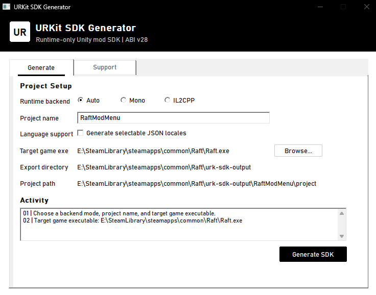

# URKit

URKit is a native C++ runtime modding framework for Windows x64 Unity games running on Mono or IL2CPP.

It provides a practical SDK for creating native C++ mods, generating game-specific projects, interacting with Unity objects, calling managed methods, installing hooks, handling main-thread callbacks, and building in-game ImGui interfaces.



URKit mods are loaded as runtime plugins by the URKit loader. They are not standalone DLLs and must not be injected directly.

## Features

- Mono and IL2CPP Unity game support
- Native C++ mod development
- Automatic SDK and project generation through `urk-sdk.exe`
- Runtime loading of compatible mod DLLs
- Unity object, scene, component, transform, camera, physics, animation, audio, and UI helpers
- Managed field and property access
- Method invocation with overload and generic method support
- Safe hook helpers and hook ownership management
- Main-thread callbacks, scene events, input, cursor, Steam identity, networking, and coroutine helpers
- ImGui overlays for DX11, DX12, and OpenGL
- Configurable mod directory
- Optional localization support
- Built-in logging and runtime diagnostics

## Installation

The public Windows x64 release contains:

- `urk-sdk.exe`
- `version.dll`
- `winhttp.dll`
- `winmm.dll`

Keep `urk-sdk.exe` anywhere convenient.

In the target game directory, place only the proxy DLL imported by the game executable. Do not rename the proxy DLL and do not place all three proxies in the same directory.

Generated mod DLLs should be placed in the game's `Mods` directory.

For loader and startup issues, check `URKit_logs.log` next to the game executable.

## Creating a Mod

Run `urk-sdk.exe`, select the target game executable, choose `Auto`, `Mono`, or `IL2CPP`, and enter a project name.

The generated project includes:

- CMake and Ninja build files
- Clang and VS Code configurations
- The public URKit SDK
- Starter lifecycle, hook, logging, UI, and configuration files

## Build requirements:

- Windows x64
- CMake 3.28 or later
- LLVM/Clang
- Ninja

Example:

```powershell
cmake --preset clang-release
cmake --build --preset clang-release --parallel
```

## Mod Directory

By default, URKit loads compatible mod DLLs from the game's `Mods` directory.

The mod directory can be changed through the runtime configuration. Mods must be
built for Windows x64 and export the required URKit initialization entry point.

## Compatibility

URKit supports both Mono and IL2CPP Unity backends. Compatibility may vary
between games, Unity versions, and runtime configurations.

Game updates can change internal layouts or behavior. Always retest your mods after updating the game or its Unity version.

## Documentation

For setup instructions and API usage, see the
[URKit SDK Handbook](docs/SDK_HANDBOOK.md).

## Related Projects

- [UnityRuntimeExplorer](https://github.com/Jadis0x/UnityRuntimeExplorer) 
  a live Hierarchy and Inspector for IL2CPP Unity games

## Licensing

The public URKit SDK source code is licensed under the MIT License.

The precompiled URKit runtime loader binaries are distributed separately under
their own binary license. The loader source code is not included in this
repository.

See the included license files for the complete terms.
