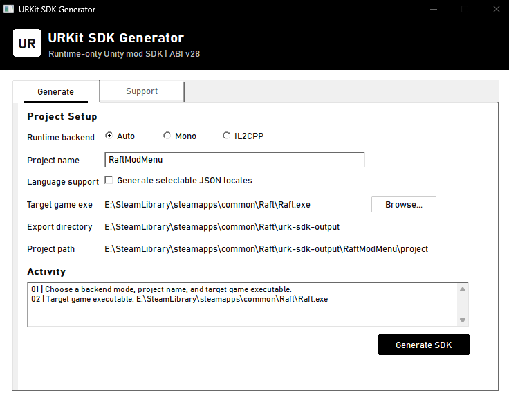

# URKit

[](https://github.com/Jadis0x/URKit/releases/latest)
[](https://github.com/Jadis0x/URKit/releases)
[](https://github.com/Jadis0x/URKit/stargazers)
[](https://discord.com/invite/XC7RUpGp6e)
[](https://github.com/Jadis0x/URKit/issues)
[](https://github.com/Jadis0x/URKit/blob/main/LICENSE)

URKit is a native C++ modding toolkit for Windows x64 Unity games. It supports
Mono and IL2CPP through one loader ABI and provides Unity object access, managed
method calls, hooks, lifecycle callbacks, networking, and ImGui overlays.

Generated mod DLLs are URKit plugins. Load them with a URKit proxy or
`URKitInjector.dll`; do not inject mod DLLs directly.



## Release contents

- `urk-sdk.exe`: project generator for Mono and IL2CPP mods.
- `urk-updater.exe`: checks and updates an existing generated project without
  replacing user-owned source files.
- `version.dll`, `winhttp.dll`, `winmm.dll`: proxy loaders. Install exactly the
  proxy imported by the game executable.
- `URKitInjector.dll`: loader for external injection workflows. URKit does not
  include an injector.
- `urk-dev-mcp.exe`: local MCP server for building, deploying, diagnosing, and
  runtime-testing generated URKit mods.
- `URKitDevBridge.dll`: optional development-only mod that executes MCP runtime
  requests on the Unity main thread.

Place the selected proxy beside the game executable. Built mods belong in the
game's `Mods` directory. Do not rename a proxy or install more than one proxy in
the same game directory.

`URKitInjector.dll` provides a proxy-free alternative. Once loaded, it prompts
for a configuration file and one or more mod DLLs; it does not create files or
scan a `Mods` directory automatically.

## Generate and build a mod

Run `urk-sdk.exe`, select a game executable and backend, then enter a project
name. The equivalent command is:

```powershell
./urk-sdk.exe --game-exe C:\Games\Example\Example.exe --backend auto --name MyMod
```

`auto` detects Mono or IL2CPP from the game directory. Add `--localization` to
include editable locale JSON files. Projects are written to:

```text
<GameDir>/urk-sdk-output/<Project>/project
```

Requirements:

- CMake 3.28 or newer;
- Ninja;
- LLVM/Clang or the MSVC toolchain from Visual Studio 2022 Build Tools or
  newer.

Clang build:

```powershell
cmake --preset clang-debug
cmake --build --preset clang-debug --parallel
```

MSVC build, from an x64 Visual Studio Developer PowerShell:

```powershell
cmake --preset msvc-debug
cmake --build --preset msvc-debug --parallel
```

Use `clang-release` or `msvc-release` for distributable builds. Generated
projects copy the resulting DLL to the selected game's `Mods` directory.

## Generated project layout

| Path | Purpose |
| --- | --- |
| `mod/lifecycle/mod_runtime.cpp` | Startup, main-thread updates, scene events, and shutdown. |
| `mod/hooks/mod_hooks.cpp` | Hook installation and removal. |
| `mod/lifecycle/mod_network.cpp` | HTTP configuration and policy. |
| `mod/support/mod_log.cpp` | Shared mod logging. |
| `mod/config/mod_config.h` | Mod identity and settings. |
| `mod/ui/theme.h` | UI styling. |

Files under `sdk/`, `mod/generated/`, and generated UI support are refreshed by
the generator. Keep custom code in separate files under `mod/`.

## Update an existing project

Run `urk-updater.exe`, choose the generated `project` directory, and select
**Check Project**. The result lists every URKit-managed file that would be
added (`+`) or refreshed (`~`). **Update Project** displays that same list in a
confirmation dialog before it creates a backup under `.urk/backups/` and
updates the files. User-owned files, such as `mod/lifecycle/mod_runtime.cpp`,
are preserved.

Use **Check Updater** to look for a newer `urk-updater.exe` release. It only
downloads the official GitHub release asset after confirmation, verifies its
published SHA-256 digest, replaces itself through a short-lived helper process,
and restarts. Every published release must therefore include `urk-updater.exe`;
the public-release staging target does this automatically.

The same flow is available for automation:

```powershell
./urk-updater.exe --project C:\Games\Example\urk-sdk-output\MyMod\project --check
./urk-updater.exe --project C:\Games\Example\urk-sdk-output\MyMod\project --update
./urk-updater.exe --check-updater
```

Projects generated by current SDK versions contain `.urk/project.ini`. Older
projects are detected from their generated SDK and CMake deployment settings;
the updater writes the manifest when it completes their first update. The
updater refuses to downgrade a project created by a newer SDK.

## Runtime notes

- Unity calls belong on the Unity main thread.
- Cache scene lookups and clear borrowed Unity handles on scene changes.
- Check `Unity::last_error()` after an unexpected empty or zero result.
- Detach hooks and release mod-owned resources before unload.
- DX11, DX12, and OpenGL overlays are supported. Vulkan overlays are not.

Loader API tables and context structures are versioned and append-only. Mods
must check the advertised `version` and `size` before accessing newer fields.
The public ABI is defined in `sdk/mod_sdk.h`.

See the [URKit SDK Handbook](docs/SDK_HANDBOOK.md) for GameObject/component
access, custom bindings, threading, hooks, and diagnostics. Its highlight
chapter documents how overlay draw commands are
projected and submitted through the generated DirectX 11, DirectX 12, or OpenGL
render path. Internal components are described in
[ARCHITECTURE.md](ARCHITECTURE.md).

## AI-assisted mod development

`urk-dev-mcp.exe` exposes the same local MCP tools to Codex, Claude, and other
stdio-capable MCP clients. It reads the generated project's `.urk/project.ini`,
uses only declared CMake presets, verifies deployment, returns bounded URKit
logs, and connects to `URKitDevBridge.dll` for runtime status and tests.

Copy `URKitDevBridge.dll` to the target game's `Mods` directory, then configure
the MCP client with the generated mod project's root:

```powershell
urk-dev-mcp.exe --project C:\Games\Example\urk-sdk-output\MyMod\project
```

Runtime tests use the fixed C ABI in `sdk/dev_test.h`. See
[URKit Development MCP](docs/DEV_MCP.md) for client configuration, test exports,
security boundaries, and troubleshooting.

For loader and startup failures, inspect `URKit_logs.log` beside the game
executable. If the file does not exist, verify that the game imports the proxy
you installed.

URKit is available under the [MIT License](LICENSE).
